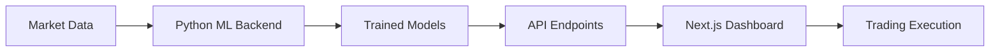

# Three Sigma: A Quantitative Market Maker

<div align="center">

**High-precision, data-driven adaptive market making for prediction markets**

[](https://nextjs.org/)
[](https://github.com)
[](https://github.com)

</div>

---

## Project Overview

**Three Sigma** is a high-precision, data-driven system designed to operate as an adaptive market maker on prediction market platforms. The project's mission is to exploit statistical mispricings ("three sigma" opportunities) by systematically quantifying risk and optimizing execution costs.

The front-end, built with **Next.js**, serves as a real-time dashboard for monitoring market opportunities, system health, and the performance of the core quantitative models.

---

## Key Quantitative Features

### Risk/Reward Scoring
Markets are prioritized using a proprietary **Risk/Reward Score** that balances:
- Market **Uncertainty** and **Volume**
- Transactional **True Average Spread**
- Market **Volatility**

### Adaptive Spread Prediction (ML Core)
The system uses trained regression models (**Random Forest**, **Gradient Boosting**) to forecast the optimal spread width for order placement. This transforms the system into an **Adaptive Market Maker**, ensuring:
- ✓ High fill rates
- ✓ Minimal inventory risk

### Deep Data Collection
Features are engineered from granular data, including:
- **Central Limit Order Book (CLOB)** snapshots
- $\log_{10}$-transformed liquidity metrics
- Historical spread and volume patterns

---

## Getting Started

This repository contains the **Next.js application** that powers the Three Sigma dashboard.

### Prerequisites

Ensure you have the following installed:

| Requirement | Version |
|------------|---------|
| Node.js | LTS version |
| Package Manager | npm or yarn |
| Backend | Python/ML Backend with `SpreadPriceModel` |

### Local Setup

**1. Install dependencies:**

```bash
npm install
# or
yarn install
```

**2. Run the development server:**

```bash
npm run dev
# or
yarn dev
```

**3. Open your browser:**

Navigate to [http://localhost:3000](http://localhost:3000) to view the application. The page auto-updates as you edit files.

---

## Data & Machine Learning Integration

The core spread prediction logic resides in a **separate quantitative environment**, typically implemented in Python. The trained ML models (e.g., `random_forest_spread_model.joblib`) are generated by training against the `optimal_spread_width` target.

### Model Integration



The Next.js application interacts with the ML environment via **internal or external API endpoints** to retrieve the current recommended `optimal_spread_width` for active markets. This predicted spread is then:
- Displayed on the dashboard
- Used by the trading execution logic

---

## Architecture

```
three-sigma/
├── 📁 frontend/          # Next.js dashboard
│   ├── components/       # React components
│   ├── pages/           # Next.js pages
│   └── styles/          # CSS/styling
├── 📁 backend/          # Python ML backend
│   ├── models/          # Trained models (.joblib)
│   ├── data/            # Feature engineering
│   └── api/             # Model serving endpoints
└── 📄 README.md
```

---

## Learn More

### Next.js Resources
- [Next.js Documentation](https://nextjs.org/docs) - Learn about Next.js features and API
- [Learn Next.js](https://nextjs.org/learn) - Interactive Next.js tutorial
- [Next.js GitHub](https://github.com/vercel/next.js/) - Contribute and explore

### Deployment

The easiest way to deploy your Next.js app is to use the [Vercel Platform](https://vercel.com/new):

[](https://vercel.com/new)

Check out the [Next.js deployment documentation](https://nextjs.org/docs/deployment) for more details.
---


<div align="center">

</div>